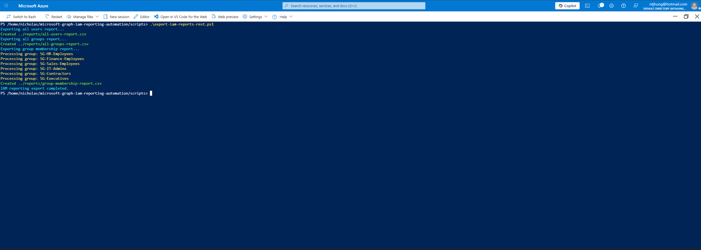
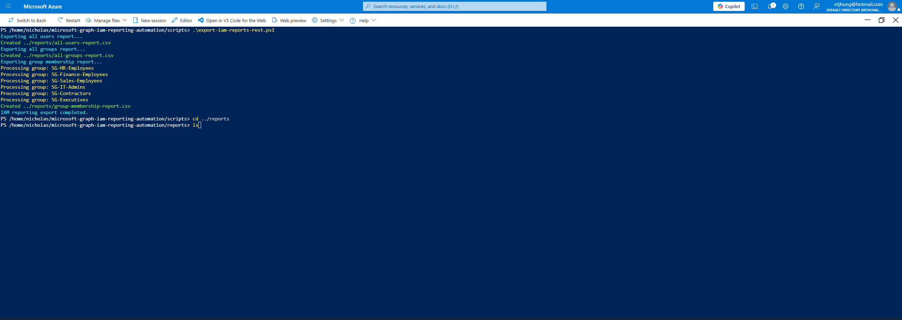
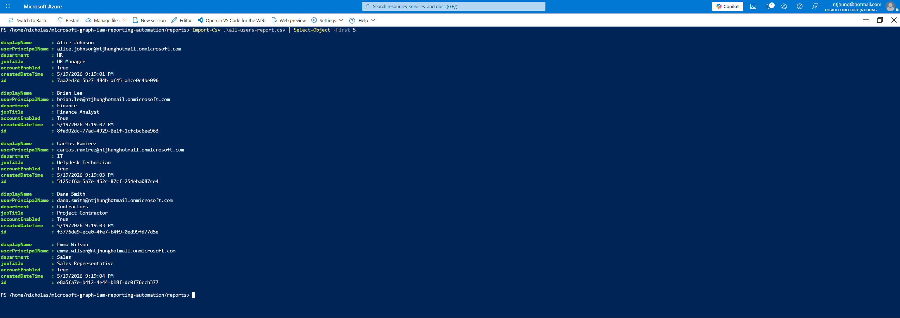

# Microsoft Graph IAM Reporting Automation

## Project Overview

This project demonstrates IAM reporting automation using Microsoft Graph and PowerShell. The lab simulates how an IAM team can export users, groups, group memberships, and access evidence from Microsoft Entra ID.

The goal is to show how automation can support audit readiness, access reviews, identity governance, and IAM operations.

## Business Problem

IAM teams often need to provide reports for audits, access reviews, security investigations, and user lifecycle management. Manually collecting this information can be slow and error-prone. Automation helps standardize reporting and improves evidence collection.

## Tools Used

- Microsoft Entra ID
- Microsoft Graph REST API
- PowerShell
- Azure Cloud Shell
- CSV reporting
- GitHub documentation
- Screenshots as audit evidence

## What This Project Demonstrates

- Microsoft Graph reporting automation
- IAM reporting
- User export reporting
- Group export reporting
- Group membership reporting
- Audit evidence collection
- Access review support
- PowerShell scripting
- IAM documentation

## Reports Created

- reports/all-users-report.csv
- reports/all-groups-report.csv
- reports/group-membership-report.csv

## Scripts Created

- scripts/export-users.ps1
- scripts/export-groups.ps1
- scripts/export-group-memberships.ps1
- scripts/export-iam-reports-rest.ps1

## Project Files

- scripts/
- reports/
- docs/
- screenshots/

## Documentation Created

- docs/Reporting-Plan.md

## Lab Screenshots

### Microsoft Graph REST Script Success

### Reports Folder

### All Users Report Preview

### Group Membership Report Preview

## Key IAM Concepts Demonstrated

### IAM Reporting

IAM reporting helps security and IT teams understand users, groups, and access assignments.

### Audit Evidence

CSV reports and screenshots can be used as evidence during access reviews, audits, and compliance checks.

### Group Membership Review

Exporting group membership helps IAM teams validate whether users still need assigned access.

### Automation

PowerShell automation reduces manual work and makes IAM reporting more repeatable.

### Microsoft Graph

Microsoft Graph can be used to query Microsoft Entra ID user, group, and membership data for reporting and audit purposes.

## Lab Notes

The original Microsoft Graph PowerShell cmdlet approach ran into module loading issues in Azure Cloud Shell. To complete the project cleanly, a REST-based Microsoft Graph PowerShell script was created using `Invoke-RestMethod` and an Azure Cloud Shell access token.

This demonstrates practical troubleshooting and an alternate automation method when module dependencies cause issues.

## Resume Bullet

- Built a Microsoft Graph IAM reporting automation project using PowerShell and REST API calls to export Microsoft Entra ID users, groups, group memberships, and audit evidence reports for access review support.

## Status

Completed Microsoft Graph IAM reporting automation lab with PowerShell scripts, generated CSV reports, documentation, and screenshots.
